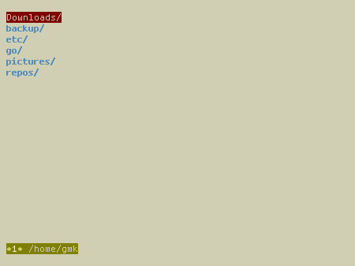

<h1 align="center">catfm 🐟</h1>

<p align="center">a simple and programmable file manager written in Go</p>
<p align="center"></p>

## About

catfm, or **C**ool **A**nd **T**echnical **F**ile **M**anager was written to emulate the pluto file manager that I started working on in late 2018. Pluto was slow and buggy so I decided that I needed to rewrite it from scratch in a new language. So voilà, you have catfm!

## Features

* Customizable file formating
* Opening files in your favorite programs
* Script intergration
* Bookmarks
* Tabs
* A customizable bar
* Overall aesthetic customizability

## Dependencies 

* ```go 1.13```
* ```tcell```
* ```bytefmt```
* ```copy```

## Building

**Clone the repository:**

```git clone http://github.com/geremachek/catfm```

**Tnstall go from your distro's repositories:**

**Install tcell:**

```go get github.com/gdamore/tcell```

**Install bytefmt**

```go get code.cloudfoundry.org/bytefmt```

**Install copy**

```go get github.com/otiai10/copy```

**Build the program**

Move into the ```catfm/``` directory and type ```go mod init``` and then ```go build```

**Move the binary to somewhere in your path**

## Configuration

You can configure the program in the ```config/config.go``` file before compiling. This speeds up the program as it doesn't have to read and parse a giant config file everytime you start up the program

I also recommend looking at the [tcell](https://godoc.org/github.com/gdamore/tcell) documentation on [color](https://godoc.org/github.com/gdamore/tcell#Color) and [styles](https://godoc.org/github.com/gdamore/tcell#Style)

### ```cd``` on exit

shell function (put this in your ```.shellrc```):

```bash
fm() {
	catfm && cd "$(< /tmp/kitty)"
}
```

## Todo

- [X] Run program/script/command on keypress
- [X] Run custom commands in the bar
- [X] Add hotkeys for directories
- [ ] Add file searching
- [ ] Add file renaming
- [X] Add ability to customize the keys for delete, move, copy, movement, etc.
- [X] Move to top or bottom screen
- [X] Add tabs
- [ ] Improve config file and keybinds
