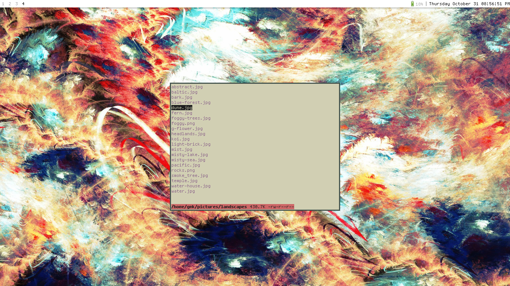

<h1 align="center">lunae 🌙</h1>

<p align="center">lunae (pronounced loon-ay) is a simple file manager that aims to improve on the now deprecated pluto file manager</p>


## Dependencies 

* ```go```
* ```tcell```
* ```bytefmt```
* ```dash```

## Building

**Clone the repository:**

```git clone http://github.com/geremachek/lunae```

**Tnstall go from your distro's repositories: (Arch Linux for example)**

```sudo pacman -S go```

**Install dash from your distro's repositories: (Arch Linux for example)**

```sudo pacman -S dash```

**Install tcell:**

```go get github.com/gdamore/tcell```

**Install bytefmt***

```go get code.cloudfoundry.org/bytefmt```

**Build the program**

Move into the ```lunae/``` directory and type ```go build```

**Move the binary to somewhere in your path**

## Configuration

You can configure the program in the ```config/config.go``` file before compiling. This speeds up the program as it doesn't have to read and parse a giant config file everytime you start up the program

### ```cd``` on exit

shell function (put this in your ```.shellrc```):

```bash
lu() {
	lunae
	cd "$(< /tmp/lunar)"
}
```

## Todo

- [X] Run program/script/command on keypress
- [X] Run custom commands in the bar
- [X] Add hotkeys for directories
- [ ] Add file searching
- [ ] Add file renaming
- [X] Add ability to customize the keys for delete, move, copy, movement, etc.
